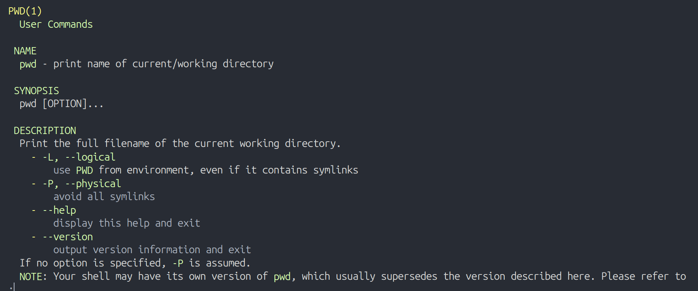

# PWD(1)
**User Commands**  

## NAME
`pwd` - print name of current/working directory

## SYNOPSIS
pwd [OPTION]...

## DESCRIPTION
Print the full filename of the current working directory.

- `-L, --logical`  
  use `PWD` from environment, even if it contains symlinks

- `-P, --physical`  
  avoid all symlinks

- `--help`  
  display this help and exit

- `--version`  
  output version information and exit

If no option is specified, `-P` is assumed.

**NOTE**: Your shell may have its own version of `pwd`, which usually supersedes the version described here. Please refer to your shell's documentation for details about the options it supports.

## AUTHOR
Written by Jim Meyering.

## REPORTING BUGS
GNU coreutils online help: [https://www.gnu.org/software/coreutils/](https://www.gnu.org/software/coreutils/)  
Report any translation bugs to [https://translationproject.org/team/](https://translationproject.org/team/)

## COPYRIGHT
Copyright © 2023 Free Software Foundation, Inc. License GPLv3+: GNU GPL version 3 or later [https://gnu.org/licenses/gpl.html](https://gnu.org/licenses/gpl.html).  
This is free software: you are free to change and redistribute it. There is NO WARRANTY, to the extent permitted by law.

## SEE ALSO
`getcwd(3)`

Full documentation [https://www.gnu.org/software/coreutils/pwd](https://www.gnu.org/software/coreutils/pwd)  
or available locally via: info '(coreutils) pwd invocation'

图片：

---

GNU coreutils 9.4 - April 2024
